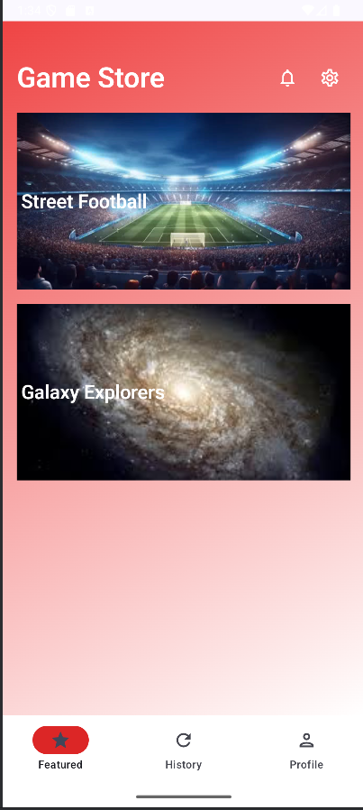

# 🎮 Game Store App

Uma aplicação móvel de loja de jogos desenvolvida em Kotlin com Jetpack Compose, seguindo as melhores práticas de desenvolvimento Android e o padrão MVC.

## 📱 Sobre o Projeto

Esta aplicação simula uma loja de jogos onde os usuários podem:
- Visualizar uma lista de jogos disponíveis
- Ver detalhes de cada jogo
- Explorar itens compráveis (DLCs, expansões, skins)
- Simular compras de itens

## 🎯 Funcionalidades

- **MainActivity**: Lista de jogos em cards com imagem de fundo
- **GameDetailActivity**: Detalhes do jogo + lista de itens compráveis
- **ModalBottomSheet**: Detalhes completos dos itens com opção de compra
- **Navegação entre Activities** usando Intents
- **Passagem de objetos** entre Activities
- **Toast de confirmação** de compra
- **Composable Previews** para todos os componentes

## 🛠️ Tecnologias Utilizadas

- **Kotlin** - Linguagem de programação
- **Jetpack Compose** - Framework de UI moderna
- **Android Studio** - IDE oficial
- **Padrão MVC** - Arquitetura do projeto
- **Parcelable** - Passagem de dados entre Activities

## 🎮 Jogos Disponíveis

### ⚽ Street Football
Jogo de futebol de rua com ambientação urbana vibrante

**Itens Compráveis:**
- 🥇 Bola de Ouro Lendária - £6.99
- 👕 Camisa Legendária Brasil - £9.99
- 🏟️ Estádio Noturno Iluminado - £11.99
- 💃 Pacote de Celebrações - £4.99

### 🚀 Galaxy Explorers
Jogo de aventura espacial com exploração intergaláctica

**Itens Compráveis:**
- 🛸 Nave Millennium X1 - £15.99
- 🌌 Expansão: Fronteira Alien - £12.99
- 👨‍🚀 Traje Espacial Quantum - £8.99
- 🤖 Companheiro Robótico AX-7 - €7.99

## 🎨 Capturas de Tela

| MainActivity | GameDetailActivity | BottomSheet |
|--------------|-------------------|-------------|
|  |  |  |

## 📦 Entregáveis

- [x] **Projeto Android Studio** (ZIP completo)
- [x] **APK** para execução no emulador
- [x] **Repositório GitHub** com código fonte
- [x] **Screenshots** de todas as Activities
- [x] **Composable Previews** implementadas

## 👨‍💻 Padrões Implementados

- **MVC (Model-View-Controller)**
- **Separação de responsabilidades**
- **Composable functions reutilizáveis**
- **Passagem de dados com Parcelable**
- **Preview annotations** para desenvolvimento

## 📝 Licença

Este projeto foi desenvolvido para fins educacionais como parte da disciplina de Programação para Dispositivos Móveis.

## 👤 Desenvolvido por

Taha-Wur Pereira - Engenharia Informática

---
